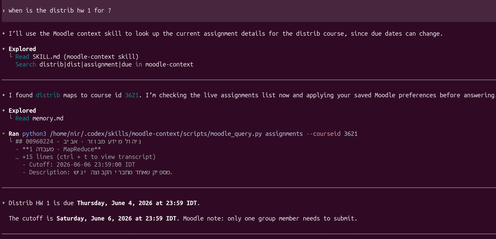

# Moodle Context Skill



A small read-only helper that lets an AI assistant answer Moodle questions from live Technion Moodle data.

## Features

- Lists your visible Moodle courses.
- Shows homework, lab, and assignment deadlines.
- Checks submission status.
- Reads course sections and forum posts.
- Lists assignment files and extracts text from PDFs.

## Get Started

Install the Python tools:

```bash
uv sync
```

Create your private config file:

```bash
cp config.ini.example config.ini
```

Open `config.ini`. It should look like this:

```ini
[moodle]
token=
domain=moodle25.technion.ac.il
```

## Get Your Moodle Token

1. Open this link in your browser:

```text
https://moodle25.technion.ac.il/admin/tool/mobile/launch.php?service=moodle_mobile_app&passport=12345&urlscheme=moodlemobile
```

2. Log in to Moodle if it asks.
3. Moodle redirects you to a new page.
4. Copy the long value after `token=` in the redirected URL.
5. Paste it into `config.ini`.

Example:

```ini
[moodle]
token=PASTE_YOUR_TOKEN_HERE
domain=moodle25.technion.ac.il
```

## Try It

Check that the skill can talk to Moodle:

```bash
python3 scripts/moodle_query.py init
```

List your courses:

```bash
python3 scripts/moodle_query.py courses
```

Show all visible assignment deadlines:

```bash
python3 scripts/moodle_query.py assignments
```

Show assignments for one course:

```bash
python3 scripts/moodle_query.py assignments --courseid 3621
```

## Useful Commands

Read the course content page:

```bash
python3 scripts/moodle_query.py course-content --courseid 3621
```

Check one assignment submission:

```bash
python3 scripts/moodle_query.py submission-status --assignid 14221
```

List assignment files:

```bash
python3 scripts/moodle_query.py assignment-files --assignid 14221 --courseid 3621
```

Extract text from an assignment PDF:

```bash
python3 scripts/moodle_query.py file-text --assignid 14221 --courseid 3621 --filename 'Homework'
```

Run the tests:

```bash
uv run python -m unittest discover -s tests
```

## How It Works

- `scripts/moodle_cli.py` talks to Moodle's web-service API.
- `scripts/moodle_query.py` gives simpler commands for assistants and humans.
- `SKILL.md` tells Codex when to use the Moodle helper.
- `config.ini.example` shows the token config format.
- `memory.md` stores local preferences, such as which courses to treat as current.

The tool is read-only. It can fetch Moodle data, but it does not submit assignments or change Moodle.

PDF text extraction needs `pdftotext`. On Ubuntu/Debian:

```bash
sudo apt install poppler-utils
```
